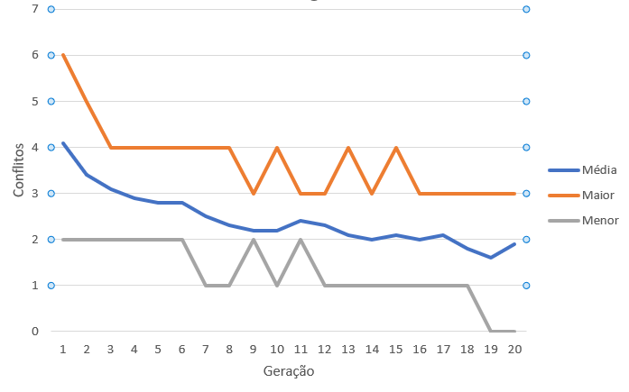
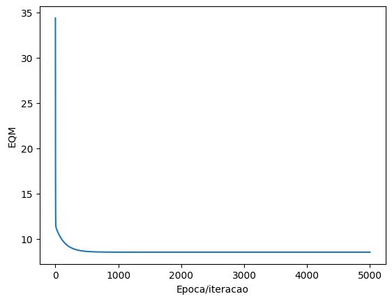
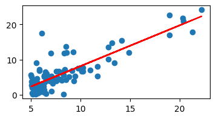
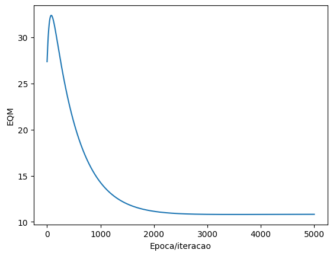
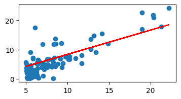

# Trabalho 3 - Otimização

# IA 2022/1 - GRUPO 5

|Nome|Cartao|Turma|
|---|---|----|
|Alice Santin Varella| 00259915 | B
|Joao Pedro Cosme da Silva|00314792 |A
|Eduardo André Leite | 00287684| A

## Algoritmo Genético

Um do conjuntos de valores que consegue atingir a execução bem sucedida (0 Ataques):

-> g:int (Número de gerações) = 20

-> n:int (Número de indivíduos) = 10

-> k:int (Número de participantes do torneio) = 2

-> m:float (Probabilidade de mutação (entre 0 e 1)) = 0.5

-> e:bool (Verdadeiro se há elitismo) = True

Menor número de ataques = 0.

## Regressão Linear

Foi utilizado o algoritmo de regressão linear por reta, usando MSE como medida de erro. Theta 0 e Theta 1 são randomicamente inicializados com valores reais entre 0 e 1.

### Normalização de Features

Foi adicionado um novo parametro a função de `fit`, um booleano para ativar a normalização de features. Neste caso, as features são normalizadas entre 0 e 1, usando o algortimo visto em aula, que possui a forma:

$(x-min_x/max_x-max_x)$

### Testes

A seguir, exemplificamos os melhores resultados de cada caso. Como o dataset é composto por apenas uma informação de entrada e uma de saida, podemos ver que a normalização de features neste caso não exerce um impacto significativo na perfomance do algoritmo, já que não há variaveis de grandezas diferentes em ação.

#### Sem normalização de features

|Variavel|Valor|
|-|-
|Theta0|Random
|Theta1|Random
|Alfa|0.01
|Iteracoes até estabilizar|<1000
EQM final| 8.52770819098256

##### Resultados

###### Erro Quadratico Medio

###### Reta Resultante

#### Com Normalização de Features

|Variavel|Valor|
|-|-
|Theta0|Random
|Theta1|Random
|Alfa|0.01
|Iteracoes até establizar|<3000
EQM final| 10.820954179569718

##### Resultados

###### Erro Quadratico Medio

###### Reta Resultante
